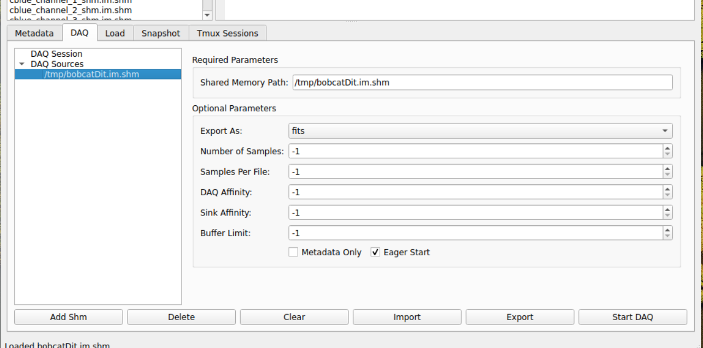

DAO Data Acquisition Tool (v3.0.0)
===================================

The DAO Data Acquisition Tool (``daoDAQ``) facilitates acquisition of various data sources within a DAO RTC system. It ships with ``daoTools`` and can be verified via ``daoDAQ --version``.

Getting Started
===============

1. Launching the Tool
---------------------

The RTC system must run an instance of the DAQ tool. To launch it, simply run:

.. code-block:: bash

    daoDAQ

By default, this outputs information-level logs to ``$DAODATA/daoDAQ.logs``.

**Logging Options:**

- ``-s`` — Output logs to stdout instead of file-based logging
- ``-vv`` — Enable verbose logging (recommended for issue reports)
- ``--help`` — Display all available launch options

.. tip::

    By default, the tool hosts a TCP communication server on port 62,000. If this port is in use, specify an alternative port at launch:

    .. code-block:: bash

        daoDAQ --port <port>

2. Configuring the Tool
-----------------------

The DAQ tool requires configuration to specify what data to record and how. Configurations are provided as YAML v1.2 documents.

Configuration Structure
~~~~~~~~~~~~~~~~~~~~~~~

A DAQ configuration contains two main sections:

- **Session parameters**: General settings for the DAQ session
- **Sources**: List of sources to acquire data from

.. important::

    All required parameters must be correctly specified. Omission or invalid values will cause a parse error and transition the tool to the Error state. The ``sources`` list is mandatory and cannot be empty.

Session Parameters
^^^^^^^^^^^^^^^^^^

Session parameters are specified at the YAML root level:

.. list-table::
   :widths: 20 15 15 20 40
   :header-rows: 1

   * - Field
     - Presence
     - Type
     - Default
     - Description

   * - ``root_storage``
     - Required
     - String
     - —
     - Absolute path where session outputs are stored on disk.

Data Sources
^^^^^^^^^^^^

Two source types are supported and should be specified under the ``sources`` list within the YAML root level:

**1. File Source**

Copies a file from disk to the session output directory when the session begins.

.. list-table::
   :widths: 20 15 15 20 40
   :header-rows: 1

   * - Field
     - Presence
     - Type
     - Default
     - Description

   * - ``uri``
     - Required
     - URI
     - —
     - Absolute path to the file, in the format ``file://<path>``.

**2. Shared Memory Source**

Acquires data samples in real-time from DAO shared memory and writes them to output datafiles on disk.

.. warning::

    Always specify a ``buffer_limit`` for shared memory sources. If omitted, the buffer is unbounded. In cases where the sink thread cannot keep pace with the rate samples are enqueued, the buffer will grow unbounded and potentially crash the system.

.. list-table::
   :widths: 20 15 15 20 40
   :header-rows: 1

   * - Field
     - Presence
     - Type
     - Default
     - Description

   * - ``uri``
     - Required
     - URI
     - —
     - Absolute path to the shared memory, in the format ``smem://<path>``.

   * - ``metadata_only``
     - Optional
     - Boolean
     - False
     - If True, capture only frame metadata; discard frame data.

   * - ``samples``
     - Optional
     - Integer
     - Unbounded
     - Number of samples to record. If omitted, collection continues until manually stopped.

   * - ``format``
     - Optional
     - String
     - FITS
     - Output datafile format. Currently only ``fits`` is supported.

   * - ``file_rollover``
     - Optional
     - Integer
     - Unbounded
     - Number of samples per output datafile. When reached, a new datafile is created for subsequent samples. Ensures individual files remain manageable in size.

   * - ``daq_affinity``
     - Optional
     - Integer
     - None
     - CPU core affinity for the data acquisition thread (Linux CPU index).

   * - ``sink_affinity``
     - Optional
     - Integer
     - None
     - CPU core affinity for the writer thread (Linux CPU index).

   * - ``buffer_limit``
     - Optional
     - Integer
     - Unbounded
     - Maximum number of samples the DAQ buffer can hold before dropping new samples.

   * - ``eager_start``
     - Optional
     - Boolean
     - True
     - An eager start captures the sample already present in shared memory when the session begins; a non-eager start waits for the next sample to arrive.

**Example Configuration:**

.. code-block:: yaml

    root_storage: /opt/DAODATA

    sources:
      - uri: file:///path/to/my/file.ext

      - uri: smem:///tmp/cblue.im.shm
        samples: 10
        file_rollover: 4
        buffer_limit: 1500

**Creating and Uploading Configurations:**

Configurations can be hand-written as YAML files or created via the user-friendly DAQ UI in the ``daoShmViewer`` GUI application (also provided by ``daoTools``).

To upload and apply a configuration via CLI:

.. code-block:: bash

    daoDAQCli.py upload <config-file>  # Upload YAML config to tool
    daoDAQCli.py apply                 # Apply the uploaded config

Alternatively, provide the configuration at launch to skip the upload step:

.. code-block:: bash

    daoDAQ --daq-configuration <config-file>
    daoDAQCli.py apply

.. note::

    When using the DAQ UI, upload and apply are handled automatically when you start the session.

.. warning::

    If configuration application fails, the tool enters an Error state. Query the tool's state with ``daoDAQCli.py state`` and refer to :ref:`error-recovery` for next steps.

3. Acquiring Data
-----------------

Once a DAQ configuration is uploaded and applied, data acquisition can begin.

**Starting a Session:**

Via the DAQ UI, click the **Start DAQ** button. Via the terminal:

.. code-block:: bash

    daoDAQCli.py acquire

**Session Completion:**

The session automatically finishes when:

- All configured sources have collected their specified number of samples (for finite-sample sources)
- All file sources have been copied

If at least one source has an unbounded sample count, the session continues until manually stopped.

When the tool automatically finishes a session, the **Start DAQ** button in the DAQ UI will reappear, indicating the session has ended. Via the CLI, you can wait for automatic completion using:

.. code-block:: bash

    daoDAQCli.py wait  # Blocks until the session ends

**Finishing a Session:**

Via the DAQ UI, click **Finish DAQ**. Via the terminal:

.. code-block:: bash

    daoDAQCli.py finish

**Data Organization:**

Captured data is written to a dedicated session directory within ``root_storage``, named with a timestamp at session start:

.. code-block:: text

    root_storage/
    └── 2026-04-22_14-30-45/           # Session Subdirectory
        ├── file_source_name.ext       # Captured file
        ├── unbounded_smem.fits        # Shared-memory samples (no rollover)
        └── rolled_smem/               # Shared-memory with rollover
            ├── rolled_smem_0.fits
            ├── rolled_smem_1.fits
            └── ...

Once a session finishes, captured data is safe to analyze, move, or archive.

.. important::

    If the tool encounters an error during a session, it will finish the session and enter an Error state. See :ref:`error-recovery` for instructions.

.. note::

    If the tool receives a SIGINT signal (e.g., ``Ctrl+C``) during an active session, it attempts graceful shutdown: finishing the session, deallocating resources, and flushing logs and data to disk. While graceful termination is safe, it is recommended to allow sessions to finish naturally before stopping the tool.

.. _error-recovery:

4. Error Recovery
-----------------

If the tool enters an Error state, it can be recovered to the Ready state using:

.. code-block:: bash

    daoDAQCli.py recover

.. note::

    Error recovery is not available via the DAQ UI; use the CLI utility as shown above.

**Common Causes:**

A frequent cause of errors is invalid configuration—typically due to missing required fields or incorrect data types. Check the logs, fix the configuration, re-upload it, and then recover.

.. warning::

    Attempting recovery while an invalid configuration is still applied will result in another Error state. Always fix and re-upload the configuration first.

**Session Errors:**

Errors during active data acquisition cause the tool to finish the session and enter an Error state.

**Last Resort:**

If recovery fails, terminate and restart the tool. Always prefer graceful termination (e.g., ``Ctrl+C`` or SIGINT) to allow logs to be flushed to disk for debugging purposes. If graceful termination fails, force termination as a last resort.

Integration with Custom Software
=================================

The DAQ UI and CLI utility depend on a client library, ``daoDAQClient.py``, which also ships with ``daoTools``. To integrate the tool into custom software, use this library. Refer to the Python source file for available API methods.