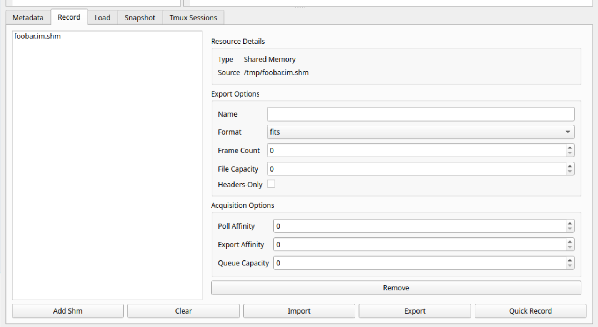

Telemetry Capture
=================
 
.. rst-class:: subtitle

   v1.2

Overview
--------

Dao provides a telemetry capture tool named ``daoTelemetry``, installed as part of the ``daoTools`` repository,
and enables high-throughput capture of various telemetry sources in parallel, stored to the disk
in a varietry of available formats.

This documentation aims to provide information on how the capture tool works, how to operate it,
and how to understand possible errors it may encounter and how to resolve them.

If you experience any issues with the capture tool, or have any questions this information
does not address, please contact thomas.n.davies@durham.ac.uk.

Usage
-----

``daoTelemetry`` is installed with other Dao tools and available in your path.

Check the tool is present and see its version:

.. code-block:: shell

   daoTelemetry --version

View available command-line options:

.. code-block:: shell

   daoTelemetry --help

Start an instance with a port number (defines the network endpoint for API communication):

.. code-block:: shell

   daoTelemetry <ENDPOINT PORT>

.. tip::

   Launch the tool in a persistent shell session (e.g., ``tmux``) to keep it running and available, even if your login session closes.

Capture Sessions
----------------

A capture session (or session) defines what telemetry sources shall be recorded and how, along
with more session specific properties. Sessions are configured via YAML v1.2 and must be provided to
the capture tool and successfully applied before the session can be carried out.

Session Configuration
---------------------

The following tables define the session and source configuration fields
available to the user. 

Some fields are required and omitting them will
cause the capture tool to fail when applying the configuration; others
are optional and can be omitted, in which case they take on the specified
default value.

Session Policies
^^^^^^^^^^^^^^^^

The session configuration must contain an object named ``session_policies`` 
containing any session-wide policies.

.. list-table:: session policies
   :header-rows: 1

   * - Field
     - Required
     - Data Type
     - Default
     - Description

   * - ``session_policies/root_storage``
     - Required
     - String
     - 
     - Absolute path where session outputs are stored to on disk.

   * - ``session_policies/group_outputs``
     - Optional
     - Boolean
     - True
     - Group session outputs into a subdirectory within root.

   * - ``session_policies/group_name``
     - Optional
     - String
     - Timestamp (eg. 2026-04-22_14-30-45)
     - Name of session's group subdirectory (if grouping is enabled).
  
   * - ``session_policies/overwrite_existing``
     - Optional
     - Boolean
     - False
     - Overwrite any conflicted items in root directory when storing session outputs.

Sources
^^^^^^^

The session configuration must contain a list named ``source_list`` 
of all sources to capture during the session.

File Sources
~~~~~~~~~~~~~~

.. list-table:: file source configuration
   :header-rows: 1

   * - Field
     - Required
     - Data Type
     - Default
     - Description

   * - ``uri``
     - Required
     - URI
     - 
     - Absolute path to the file, in the format ``file://<path>``.
 
   * - ``export_policies/save_as``
     - Optional
     - String
     - Original name
     - Name to save the file as in the session outputs.

Shared Memory Sources
~~~~~~~~~~~~~~~~~~~~~~

.. list-table:: shared-memory source configuration
   :header-rows: 1

   * - Field
     - Required
     - Data Type
     - Default
     - Description

   * - ``uri``
     - Required
     - URI
     - 
     - Absolute path to the shared memory, in the format ``smem://<path>``.
   
   * - ``export_policies/save_as``
     - Optional
     - String
     - Original name
     - Base name of the output datafile(s).
   
   * - ``export_policies/metadata_only``
     - Optional
     - Boolean
     - False
     - Capture only the frame metadata, discarding the frame data.
   
   * - ``export_policies/samples``
     - Optional
     - Integer
     - Unbounded sample target
     - Number of samples to record from the shared memory source. If omitted, collection is unbounded.
   
   * - ``export_policies/format``
     - Required
     - Format Type (``numpy``, ``fits``)
     - 
     - Format of the output datafile(s).
   
   * - ``export_policies/chunk_size``
     - Optional
     - Integer
     - Unbounded chunk limit
     - Limits the number of samples in a output datafile, possibly creating multiple datafiles to hold all samples recorded.
   
   * - ``acquisition_policies/export_affinity``
     - Optional
     - Integer
     - No affinity
     - Set the cpu core affinity of the sample export thread.
   
   * - ``acquisition_policies/poll_affinity``
     - Optional
     - Integer
     - No affinity
     - Set the cpu core affinity of the sample receive thread.
   
   * - ``acquisition_policies/buffer_limit``
     - Optional
     - Integer
     - Unbounded buffer limit
     - Sets an upper limit on the sample receive buffer (in units of frames).

Example Configuration Snippet
^^^^^^^^^^^^^^^^^^^^^^^^^^^^^

   .. code-block:: yaml

      ---

      session_policies:
         root_storage: /path/to/data/root
         overwrite_existing: yes
         group_outputs: on
         group_name: my_session

      source_list:
        - uri: file:///path/to/my/file.ext
          export_policies:
            save_as: raw-data.npy

        - uri: smem:///tmp/cblue.im.shm
          export_policies:
              save_as: camera7
              metadata_only: no
              samples: 1900
              format: numpy
              chunk_size: 70
          acquisition_policies:
              export_affinity: 7
              poll_affinity: 7
              buffer_limit: 900

Configuration UI
^^^^^^^^^^^^^^^^

The ``daoShmViewer``, installed alongside the capture tool, 
provides a user-friendly interface for configuring a capture session
and handling the API communication. See ?? for more information on
the viewer tool.

   Screen capture of the ``daoShmViewer`` tool's recording UI tab
   for user-friendly configuration and commanding of the telemetry 
   tool.

Operating Sessions
------------------

Applying a Session Configuration
^^^^^^^^^^^^^^^^^^^^^^^^^^^^^^^^

Before you can run a capture session to record your telemetry sources
you first must provide the capture tool with the session configuration
and then ask the tool to apply it - only once successfully applied
can the session then be carried out.

There are two ways to provide the capture tool with a session configuration:

- **Statically**: Pass a YAML file with the ``--config`` option:

  .. code-block:: shell

     daoTelemetry --config /path/to/my-session.yml ..

- **Dynamically**: Provide a YAML document string dynamically via the Dao component API ``Other`` method.

   You must first ensure the tool is in the ``Off`` state using the ``State`` method of
   the component API; if it is not it must be commanded into the ``Off`` state before it
   can accept a new session configuration.

 .. code-block:: python

     # De-escalate to Off state if not already.
     # Send API::Other(yamlDocString)

.. tip::

   **Static**: For situations where the session configuration need not change, 
   simply provide the session configuration at launch of the tool on the command-line.

   **Dynamic**: In cases where the session configuration must change over time,
   use the component API method, enabling automated and remote configuration of sessions.

Once the capture tool has been given a session configuration, you must now apply it. This is
acomplished by sending the capture tool the ``Init`` API method which 
will trigger an attempt to apply the active session configuration.

If the configuration is successfully applied then the tool's state will change from ``Off``
and directly into the ``Standby`` state; the capture session has now been successfully applied and can 
be started (see below).

In the case the session configuration fails to be applied, due to an invalid configuration for example,
the tool's state will change from ``Off`` and directly into the ``Error`` state.

.. tip::

   After requesting a configuration change via the component API, periodically check the tool's state until it 
   reaches one of the expected states. The state may not change immediately as the request is still processing.

Preparing a Session
^^^^^^^^^^^^^^^^^^^

Once the capture tool has been provided a session configuration and it has been
successfully applied, the tool should be in the ``Standby`` state from which you
can now prepare the capture session to be run - this creates the required
resources for recording and exporting the telemetry samples to disk. 

This is accomplished by issuing the ``Enable`` API method and will cause the
tool's state to move from ``Standby`` to ``Idle`` if it succeded. 

If the capture tool fails to begin the capture session, for example if failed to allocate
the required resources for recording the telemetry sources, its state will directly move
from ``Standby`` into ``Error``. See ?? for how to recover the tool from an error.

Running a Session
^^^^^^^^^^^^^^^^^

Once the capture tool has created all required resources for the active capture session
it will be in the ``Idle`` state and you can begin a capture session by issuing the 
API method ``Run``.

If the capture session has launched and is currently running then the tool's state will
be ``Running``.

If the capture session failed to start or it experienced an issue during capture then the tool's
state will be ``Error`` and which point all telemetry capture is stopped and the tool must be
recovered from the error before it can be used for further capture.

.. important:: Failed Capture Sessions and Best Practises

   In the case a capture session encounters an issue, the datafiles open
   for exporting of samples at the time of the issue may be corrupt and
   their samples lost.

   It is recommended to configure your capture sessions to use multiple datafiles
   per telemetry source which will ensure only the datafile being actively written
   to may experience corruption in the case of a failed session whereas the other
   datafiles already written and closed should be safe and their data in-tact.

Stopping a Session
^^^^^^^^^^^^^^^^^^

If a capture session consists of telemetry sources which have a bounded number
of target samples specified then the capture tool will automatically stop
the session once all samples have been collected and it will safely end
the session; at which point the tool's state will change from ``Running`` back
to ``Idle``.

If at least one telemetry source has an unbounded number of samples for collection
in the session configuration then the capture tool will run the session until
it is stopped via the component API; this is acomplished by issuing the ``Idle``
method which will trigger the tool to stop and end the running session whereby the
tool's state will return to ``Idle``.

.. important::

   Failure to allow a capture session to complete its stoppage and cleanup
   proceedure may result in lost telemetry samples.

   Therefore always ensure the current session has been successfully ended
   by checking the tool's state.

.. note::
   
   Once a capture session has successfully finished, the tool's state
   returns to ``Idle`` from which you directly run another session
   of the same configuration.

   If you require now to run a session with a new configuration you
   must follow the aforementioned proceedure to provide and apply
   said session configuration before running such session.
